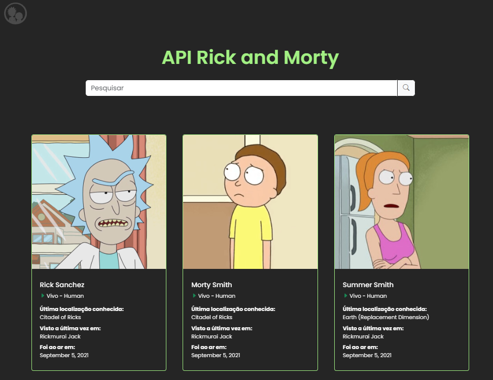
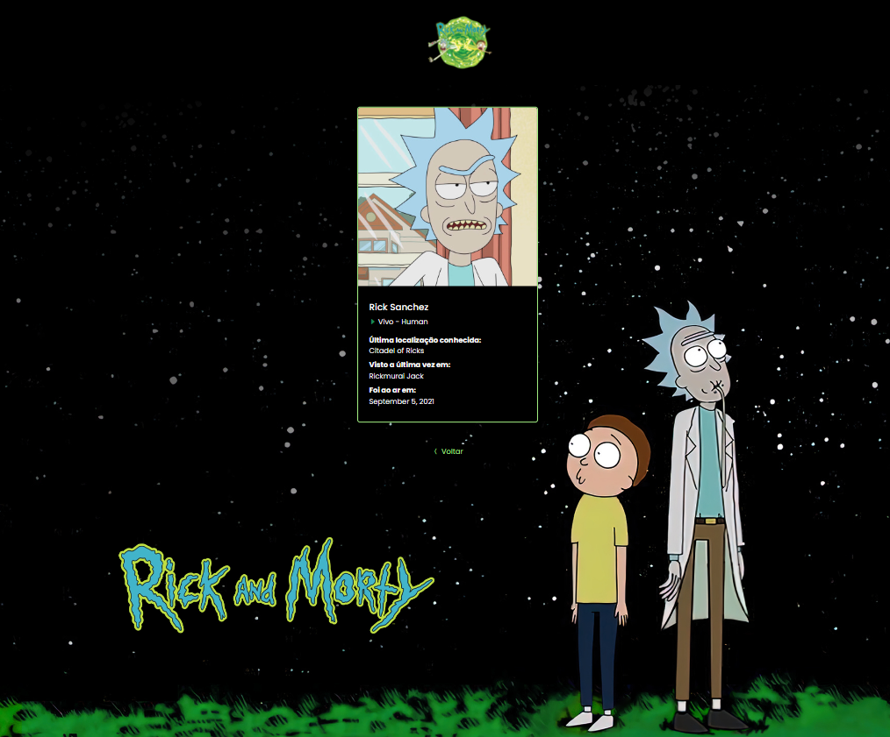

<h1>Trabalho final de módulo front-end III do curso Full Stack Web da Growdev.</h1>

 
 

O trabalho tem como ojetivo criar uma aplicação Web para listagens da serie Rick and Morty, usando HTML, CSS, Bootstrap e JavaScript.

Confira como ficou: https://rick-morty-api-bootstrap.vercel.app/

